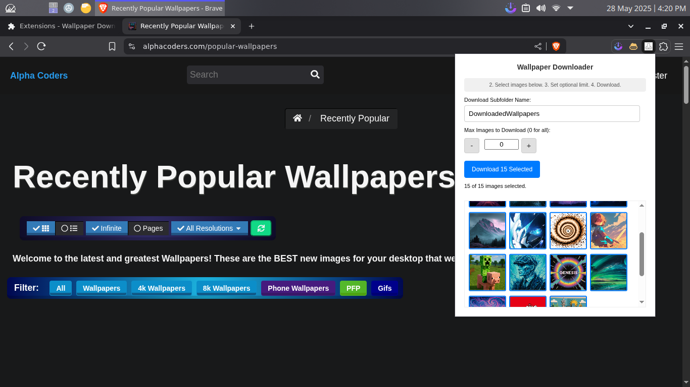

# WallpaperDownloaderExtension - Chrome Extension

[](https://opensource.org/licenses/MIT)

**A simple and effective Chrome extension to download all PNG and JPEG images from the current webpage. Ideal for quickly grabbing wallpapers from your favorite free wallpaper websites!**




This extension allows you to easily scan a webpage for images, preview them, select the ones you want, and download them into a specified subfolder within your Chrome downloads directory.

---

## 🖼️ Features

*   **Comprehensive Image Scanning:** Detects `.png`, `.jpeg`, and `.jpg` images from `` tags (including `srcset`) and `<picture>` elements on the active webpage.
*   **Image Previews:** Displays thumbnails of all found images, allowing you to visually inspect them before downloading.
*   **Selective Downloading:** Click on image previews to select or deselect individual images for download.
*   **Bulk Selection:** "Select All" and "Deselect All" buttons for quick management of image selections.
*   **Download Limit:** Specify the maximum number of selected images to download, or download all selected images.
*   **Custom Subfolder:** Set a custom name for the subfolder where images will be saved (within your default Chrome downloads folder). Your preference is remembered.
*   **Duplicate Prevention:** Intelligently identifies unique images even if they are linked multiple times or with different query parameters on the page, ensuring each distinct image is downloaded only once.
*   **User-Friendly Interface:** Clean and intuitive popup UI with clear instructions.
*   **Concurrency Management:** Downloads up to 15 images concurrently for efficient downloading without overwhelming the browser.

---

## 🚀 Installation (Manual)

Since this extension is not yet on the Chrome Web Store, you can install it manually by following these steps:

1.  **Download or Clone the Repository:**
    *   **Option A (Download ZIP):**
        *   Click the green "Code" button on this GitHub repository page.
        *   Select "Download ZIP."
        *   Extract the contents of the downloaded ZIP file to a folder on your computer (e.g., `WallpaperDownloaderExtension`).
    *   **Option B (Clone with Git):**
        ```bash
        git clone https://github.com/snowballons/WallpaperDownloaderExtension.git
        ```
        

2.  **Open Chrome Extensions Page:**
    *   Open your Google Chrome browser.
    *   Type `chrome://extensions` in the address bar and press Enter.

3.  **Enable Developer Mode:**
    *   In the top right corner of the Extensions page, find the "Developer mode" toggle and switch it **ON**.

4.  **Load the Extension:**
    *   You should now see a button labeled "Load unpacked." Click it.
    *   A file dialog will open. Navigate to and select the **root folder** of the extension (the `WallpaperDownloaderExtension` folder that contains the `manifest.json` file).
    *   Click "Select Folder" (or "Open").

5.  **Done!**
    *   The "Wallpaper Downloader" extension icon should now appear in your Chrome toolbar (you might need to click the puzzle piece icon to pin it).

---

## 💡 How to Use

1.  **Navigate to a Webpage:** Go to any website that offers free wallpapers or has many images you'd like to download (e.g., Unsplash, Pexels, Alphacoders, etc.).
2.  **Activate the Extension:** Click on the **Wallpaper Downloader** icon in your Chrome toolbar. The extension popup will appear.
3.  **Start Scan:**
    *   The popup will initially instruct you. Click the "**Start Scan**" button.
    *   The extension will scan the current webpage for suitable images.
4.  **Review and Select Images:**
    *   Once the scan is complete, thumbnails of all found `.png` and `.jpeg`/`.jpg` images will be displayed.
    *   By default, all found images are selected.
    *   Click on any image preview to **deselect** it. Click again to **reselect** it.
    *   Use the "**Select All**" and "**Deselect All**" buttons for quick management.
5.  **Set Download Options (Optional):**
    *   **Subfolder Name:** You can change the "Download Subfolder Name" (default is `DownloadedWallpapers`). This will be a subfolder created inside your main Chrome downloads directory.
    *   **Max Images to Download:** Set a numerical limit if you only want to download a certain number of your selected images (e.g., the top 5). Use `0` to download all currently selected images.
6.  **Download:**
    *   The main button will now say something like "Download X Selected." Click it.
    *   The selected images (up to your specified limit) will be downloaded into the subfolder you defined within your Chrome's default downloads location.
7.  **Check Your Downloads:** Open your Chrome downloads folder (or the subfolder you specified) to find your images!

---

## 🛠️ For Developers / Contributing

This project is open source and contributions are welcome!


**Possible Areas for Contribution:**

*   Support for more image types (e.g., WEBP, GIF - with an option to toggle).
*   Filtering images by minimum dimensions (width/height).
*   More advanced background image detection from CSS.
*   Improved UI/UX, themes (e.g., dark mode).
*   Unit/Integration tests.

**To Contribute:**

1.  Fork the repository.
2.  Create a new branch for your feature or bug fix (`git checkout -b feature/your-feature-name`).
3.  Make your changes.
4.  Commit your changes (`git commit -am 'Add some amazing feature'`).
5.  Push to the branch (`git push origin feature/your-feature-name`).
6.  Open a Pull Request.

Please ensure your code follows the existing style and is well-commented where necessary.

---

## 📄 License

This project is licensed under the **MIT License**. See the [LICENSE](LICENSE) file for details.

---

Happy Downloading! 🖼️✨

